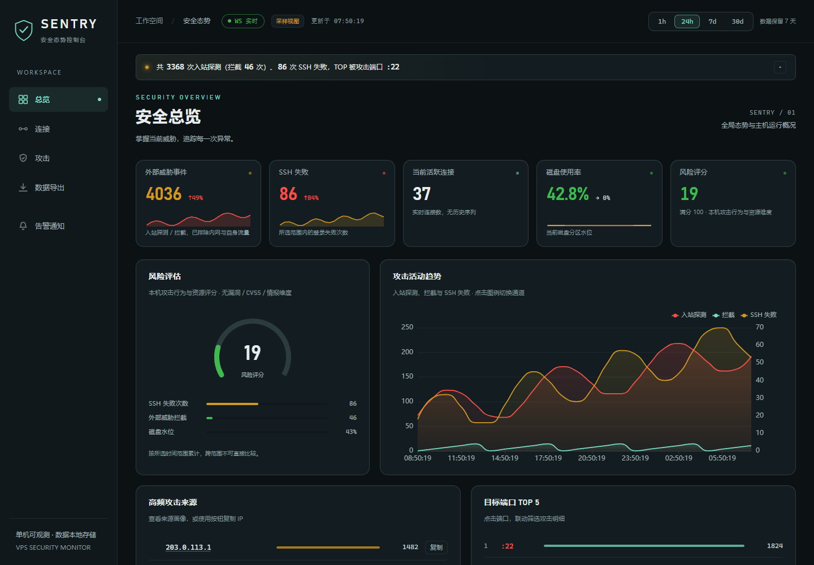

# SENTRY 前端视觉升级验证记录

日期：2026-09-08。任务范围：仅优化前端及对应文档。原始基线：`c5b0aa833520b84c08affb4c4c4ea18cc4baddb1`。

## 交付与证据边界

前端实现与本地运行验证由主 Agent 执行，独立 `reviewer` 负责只读静态复核，未调用独立 `verifier`。本次为前端普通变更，未改变认证、后端接口、数据库、采集流程、风险计算、部署或业务配置。

测试在真实 Chromium `127.0.6533.17` 中加载项目 HTML、JavaScript、ECharts 和地图资源；API 响应由测试路由返回受控示例。截图中的 IP 使用文档示例地址，密码使用测试值，所有图表仅展示样例。WebSocket 仅验证本地真实握手和连接徽章，不代表生产数据帧已回归。

## 最终候选版本

以下 Git blob 标识对应完成浏览器验证时的文件内容，避免将文档提交时间与测试基线混淆：

| 文件 | Git blob |
| :--- | :--- |
| `internal/web/static/index.html` | `1dc0e9325fb9f223a89c2667cd6ad1d6b4107c89` |
| `internal/web/static/app.js` | `1bc6f5f56e6d4cf51dec4a7bfe65bcc816c53303` |
| `docs/verification/tools/frontend_visual_check.py` | `249da95882364aa4c286d97ae6e2de120a294dbd` |

## 验收标准与结果

| 验收项 | 状态 | 证据 |
| :--- | :--- | :--- |
| 四页统一主题、布局与说明层级 | 已验证 | 桌面总览、连接、攻击、导出截图；主 Agent 目检总览、移动端与导出页 |
| 320～1920px 无整页横向溢出 | 已验证 | 四页 × 10 档宽度，逐页比较 `scrollWidth` 与视口宽度 |
| 原有页签、折叠与过滤可用 | 已验证 | 页签焦点、四类明细展开、端口跨页联动、国家下拉、全局过滤清除断言 |
| 密码仍默认遮蔽，IP 画像可用 | 已验证 | 默认遮蔽 → 显示 → 再遮蔽；打开画像并关闭 |
| 时间范围与导出交互可用 | 已验证 | 四档全局范围、导出预设选中态、自定义模式清除选中态、CSV 下载事件、无效起止时间校验 |
| 空态与错误态区分明确 | 已验证 | 零攻击显示 0 与空态说明；HTTP 503 显示 `--` 和错误横幅 |
| 无新增脚本与 CSP 错误 | 已验证 | 未捕获 JS 错误为 0，无 CSP 错误；预期失败场景记录 15 次 HTTP 503 |
| Go 内嵌资源可测试、可构建 | 已验证 | `go test ./internal/web` 通过，Windows 主程序构建退出码 0 |
| JS 语法与补丁格式有效 | 已验证 | `node --check internal/web/static/app.js` 与 `git diff --check` 通过 |
| 范围限定为前端及对应文档 | 已验证 | Git 变更仅涉及前端两文件、前端说明、前端验证脚本及截图证据 |

机器结果：[results.json](evidence/fe20260908/results.json)，共 17 组检查通过，记录 151 次受控 API 请求。运行脚本见 [frontend_visual_check.py](tools/frontend_visual_check.py)，复跑前提见 [工具说明](tools/README.md)。

## 视觉证据

以下图片均为受控示例数据，不代表生产主机状态。

- [总览完整页面](evidence/fe20260908/overview-desktop.png)
- [连接页面](evidence/fe20260908/connections-desktop.png)
- [攻击页面](evidence/fe20260908/attack-desktop.png)
- [数据导出页面](evidence/fe20260908/export-desktop.png)
- [390px 移动端总览](evidence/fe20260908/overview-mobile.png)

## 独立审查与整改

独立 reviewer 使用固定 `gpt-5.6-luna / xhigh`，任务编号 `01a07e3a-93cb-76f3-a650-bce0e8e33d8d`。只读静态核对确认既有 DOM ID 无移除或重复，页签对应关系与 API 调用契约保持不变。

首轮提出极窄屏导航风险、初始导航选中语义、导出预设可访问状态、旧主题色与死样式残留。对应处理：导航内部横向滚动、初始 `aria-current`、预设及自定义模式 `aria-pressed` 同步、统一色值与 favicon、清理旧标题扫描样式。320 / 375px 与导出语义断言已在最终候选内容上通过。

第二轮增量静态复核结论：`PASS_WITH_NOTES`，未发现新的 P0 / P1 / P2 问题，未遗留阻断交付的问题。剩余 P3 为选中行规则旁的历史颜色注释，主 Agent 已仅修改该注释并重新运行前端回归；可执行样式和 JavaScript 与第二轮审查内容一致。该静态结果与主 Agent 的动态结果分别记录，不视为独立运行验证。

## 未验证项与 N/A

- 未连接生产 API、生产 WebSocket 或真实攻击数据；未验证导出文件与生产数据库的一致性。
- 未进行 Firefox、Safari、真实移动设备及完整屏幕阅读器验证；本次浏览器缩放之外的平台字体回退可能有细微差异。
- 未执行持续 CPU / 内存压测，不据此声称达到任何新的性能指标。
- 后端修改、数据库迁移、远程部署、独立 verifier：N/A，本次前端普通变更，主 Agent 已进行相关运行验证。
- `.gitignore` 修改：N/A，现有规则已覆盖 `.dev-fe-test/`、构建产物与 Python 缓存。

前端通过 Go 编译时内嵌，现有旧二进制不会自动更新。本次仅创建本地提交，不部署；验证用临时监听端口在测试结束后关闭。
